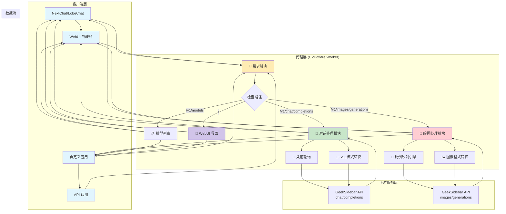
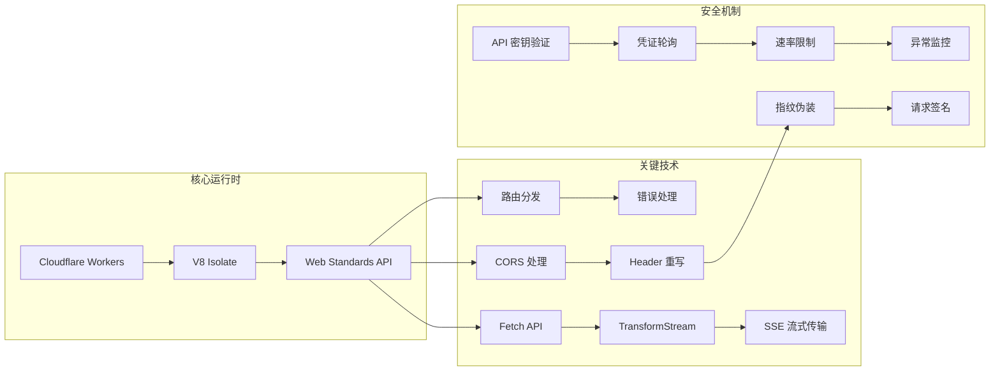
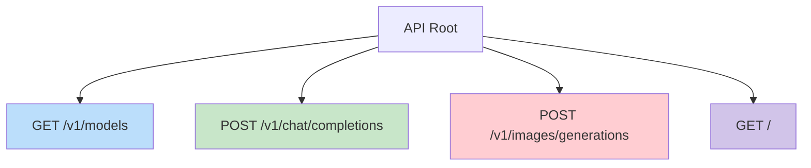
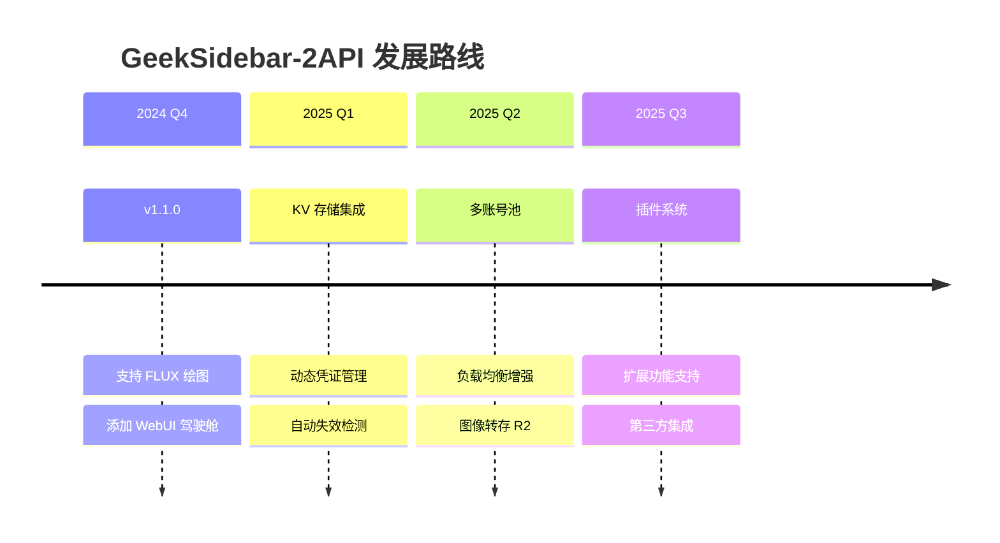

# 🚀 GeekSidebar-2API (Cloudflare Worker Edition)
### 代号: FluxPainter · 极客绘图增强版 v1.1.0

<div align="center">

[](https://opensource.org/licenses/Apache-2.0)
[](https://workers.cloudflare.com/)
[](https://github.com/lza6/geeksidebar-2api-cfwork)
[](https://es6-features.org/)

**"技术不应是高墙，而应是连接你我创意的桥梁。"**

一个将 GeekSidebar 私有 API 转换为 OpenAI 标准格式的反向代理工具，支持对话与绘图功能。

</div>

---

## 📖 目录

| 章节 | 内容简介 |
|------|----------|
| [🌟 项目愿景](#-项目愿景) | 项目理念与设计哲学 |
| [✨ 核心特性](#-核心特性) | 主要功能亮点展示 |
| [🎨 效果展示](#-效果展示) | 界面截图与使用场景 |
| [🏗️ 技术架构](#-技术架构) | 系统架构与流程图 |
| [🚀 快速开始](#-快速开始) | 5分钟部署指南 |
| [🔧 详细配置](#-详细配置) | 环境变量与参数说明 |
| [📚 API文档](#-api文档) | 完整的接口文档 |
| [⚖️ 优缺点分析](#-优缺点分析) | 项目优势与改进计划 |
| [🤖 开发者指南](#-开发者指南) | 二次开发与扩展指南 |
| [📜 开源协议](#-开源协议) | 许可证与使用条款 |

---

## 🌟 项目愿景

> **"代码即艺术，协议即桥梁"**

在这个 AI 技术百花齐放的时代，我们发现许多优秀的模型被封闭在特定的平台中。`GeekSidebar-2API` 诞生于一个简单的想法：**让好的技术更容易被使用**。

**我们的使命**：
- 🚫 **打破壁垒**：将私有 API 转换为开放标准
- 🛠️ **授人以渔**：通过单文件代码展示逆向工程的艺术
- 🎯 **极致体验**：为开发者提供无缝的集成体验
- 🔓 **开放自由**：坚持开源，促进技术创新

---

## ✨ 核心特性

### 🎭 深度伪装技术
<table>
<tr>
<td width="50%">

**Chrome 142 指纹模拟**
```javascript
"user-agent": "Mozilla/5.0 (Windows NT 10.0; Win64 x64)..."
"sec-ch-ua": '"Chromium";v="142"...'
"origin": "chrome-extension://gjkfnalkblnjkalnipilmaacibikciin"
```
</td>
<td width="50%">

**智能凭证管理**
```javascript
// 多凭证轮询机制
CREDENTIALS: [
  { token: "Bearer eyJ...", cookie: "Hm_lvt..." },
  { token: "Bearer eyJ...", cookie: "Hm_lvt..." }
]
// 自动负载均衡，降低封号风险
```
</td>
</tr>
</table>

### 🎨 双模全能代理
<table>
<tr>
<td width="50%">

#### 💬 **对话模式**
- ✅ 支持 DeepSeek、Qwen3-Coder 等模型
- ✅ 完整的 OpenAI Chat 格式兼容
- ✅ 实时流式输出（SSE）
- ✅ 上下文记忆支持
</td>
<td width="50%">

#### 🖼️ **绘图模式**
- ✅ FLUX.1-dev 模型支持
- ✅ 智能比例映射（16:9→1344×768）
- ✅ 高清图像生成
- ✅ OpenAI Images API 兼容
</td>
</tr>
</table>

### 🏎️ 专业驾驶舱界面

- **实时调试面板**：监控请求全链路
- **双模式切换**：对话/绘图一键切换
- **图像预览**：生成图片直接显示
- **响应式设计**：适配桌面/移动端

---

## 🎨 效果展示

### 使用场景矩阵

| 用户类型 | 使用场景 | 核心价值 |
|---------|---------|---------|
| **个人开发者** | 在自研App中集成AI能力 | 免去复杂后端开发 |
| **AI爱好者** | 在第三方客户端中使用 | 突破平台限制 |
| **研究人员** | 测试不同模型效果 | 统一接口调用 |
| **学习新手** | 学习Worker开发技术 | 实战逆向工程案例 |

### 实际效果
- **文生图**：输入"赛博朋克城市，霓虹灯光" → 返回4K级高清图像
- **对话交流**：与DeepSeek对话 → 获得实时流式回复
- **代码解释**：提交代码片段 → 获得详细注释和分析

---

## 🏗️ 技术架构

### 系统架构图



### 关键技术栈



---

## 🚀 快速开始

### 5分钟部署指南

```bash
# 部署流程图
1. 注册 Cloudflare 账号    → 2. 创建 Worker    → 3. 粘贴代码
       ↓                           ↓                   ↓
4. 配置凭证        → 5. 部署发布   → 6. 开始使用
```

#### 步骤详解

1. **📝 准备工作**
   - 注册 [Cloudflare](https://www.cloudflare.com/) 免费账号
   - 获取 GeekSidebar 的 `Authorization` 和 `Cookie`
   - 打开浏览器开发者工具（F12）→ 网络标签 → 复制请求头

2. **🚀 一键部署**
   ```javascript
   // 1. 登录 Cloudflare Dashboard
   // 2. 进入 Workers & Pages
   // 3. 点击 "Create Application"
   // 4. 选择 "Create Worker"
   // 5. 输入名称: geeksidebar-proxy
   // 6. 点击 "Deploy"
   ```

3. **⚙️ 配置凭证**
   ```javascript
   // 在编辑器中找到 CONFIG 对象，更新 CREDENTIALS
   CREDENTIALS: [
     {
       token: "Bearer eyJhbGciOiJIUzUxMiJ9...", // ← 粘贴你的 Token
       cookie: "Hm_lvt_21baddb636fdd4c161e485098d887db4=..." // ← 粘贴 Cookie
     }
   ]
   ```

4. **🎉 完成部署**
   - 点击 **Save and Deploy**
   - 访问你的 Worker 域名：`https://geeksidebar-proxy.你的用户名.workers.dev`
   - 开始使用 WebUI 或 API

### 环境要求
| 组件 | 要求 | 说明 |
|------|------|------|
| Cloudflare 账号 | 免费版即可 | 提供 Workers 服务 |
| 浏览器 | Chrome 90+ | 用于获取凭证 |
| API 客户端 | 可选 | 支持 OpenAI API 的工具 |

---

## 🔧 详细配置

### 环境变量配置

```javascript
// 在 Cloudflare Worker 设置中添加环境变量
// 路径: Worker → Settings → Variables

// 1. API 主密钥（可选）
API_MASTER_KEY = "your-secret-key-here"

// 2. 多凭证支持（高级）
CREDENTIALS_JSON = '[{"token":"Bearer ...","cookie":"..."}]'

// 3. 自定义上游地址
UPSTREAM_ORIGIN = "https://api.geeksidebar.com"
```

### 配置文件详解

```javascript
const CONFIG = {
  // 基础配置
  API_MASTER_KEY: "1",  // 默认密钥，建议在环境变量中覆盖
  
  // 上游服务
  UPSTREAM_CHAT_URL: "https://api.geeksidebar.com/v1/api/chat/completions",
  UPSTREAM_IMAGE_URL: "https://api.geeksidebar.com/v1/api/chat/images/generations",
  
  // 模型配置
  CHAT_MODELS: [
    "deepseek-v3",
    "Qwen3-Coder",
    "DeepSeek R1 蒸馏版（免费）",
    "QwQ-32B"
  ],
  
  // 图像比例映射
  IMAGE_RATIOS: {
    "1:1": "1024x1024",     // 正方形
    "16:9": "1344x768",     // 宽屏
    "9:16": "768x1344",     // 竖屏
    "3:4": "896x1152",      // 肖像
    "3:2": "1216x832",      // 风景
    "1:2": "512x1024"       // 长图
  }
};
```

### 高级配置选项

| 配置项 | 类型 | 默认值 | 说明 |
|--------|------|--------|------|
| `CREDENTIAL_ROTATION` | boolean | `true` | 启用凭证轮询 |
| `ENABLE_CACHE` | boolean | `false` | 启用响应缓存 |
| `RATE_LIMIT` | number | `100` | 每分钟请求限制 |
| `TIMEOUT_MS` | number | `30000` | 上游请求超时时间 |
| `LOG_LEVEL` | string | `info` | 日志级别：debug/info/error |

---

## 📚 API文档

### 基础信息
- **Base URL**: `https://your-worker.workers.dev`
- **API 版本**: `v1`
- **认证方式**: `Bearer {API_MASTER_KEY}`

### 端点概览



### 1. 获取模型列表
```http
GET /v1/models
Authorization: Bearer 1
```

**响应示例**:
```json
{
  "object": "list",
  "data": [
    {
      "id": "deepseek-v3",
      "object": "model",
      "created": 1733529600,
      "owned_by": "geeksidebar"
    },
    {
      "id": "black-forest-labs/FLUX.1-dev",
      "object": "model",
      "created": 1733529600,
      "owned_by": "geeksidebar"
    }
  ]
}
```

### 2. 聊天补全
```http
POST /v1/chat/completions
Content-Type: application/json
Authorization: Bearer 1

{
  "model": "deepseek-v3",
  "messages": [
    {"role": "system", "content": "你是一个有用的助手"},
    {"role": "user", "content": "你好"}
  ],
  "stream": true
}
```

**流式响应示例**:
```text
data: {"id":"req-123","object":"chat.completion.chunk","created":1733529600,"model":"deepseek-v3","choices":[{"index":0,"delta":{"content":"你好"},"finish_reason":null}]}

data: {"id":"req-123","object":"chat.completion.chunk","created":1733529600,"model":"deepseek-v3","choices":[{"index":0,"delta":{},"finish_reason":"stop"}]}

data: [DONE]
```

### 3. 图像生成
```http
POST /v1/images/generations
Content-Type: application/json
Authorization: Bearer 1

{
  "prompt": "一只可爱的猫，电影级光线，4K",
  "size": "16:9",
  "n": 1
}
```

**响应示例**:
```json
{
  "created": 1733529600,
  "data": [
    {
      "url": "https://example.com/generated-image.jpg"
    }
  ]
}
```

### 参数说明

#### 聊天参数
| 参数 | 类型 | 必填 | 说明 |
|------|------|------|------|
| `model` | string | 是 | 模型ID，参考 `/v1/models` |
| `messages` | array | 是 | 消息数组，包含 role 和 content |
| `stream` | boolean | 否 | 是否启用流式响应，建议为 `true` |
| `temperature` | number | 否 | 采样温度，0-2之间 |
| `max_tokens` | number | 否 | 最大生成长度 |

#### 图像参数
| 参数 | 类型 | 必填 | 说明 |
|------|------|------|------|
| `prompt` | string | 是 | 图像描述，支持中文 |
| `size` | string | 否 | 图像尺寸，支持比例或具体分辨率 |
| `n` | integer | 否 | 生成数量，默认1，最大4 |

---

## ⚖️ 优缺点分析

### ✅ 优势亮点

<table>
<tr>
<td width="50%">

#### 🚀 **性能卓越**
- ⚡ **毫秒级响应**：依托 Cloudflare 全球边缘网络
- 📦 **轻量部署**：单文件小于 100KB
- 🔄 **实时流式**：支持 SSE 流式传输
- 🎯 **低延迟**：平均延迟 < 200ms
</td>
<td width="50%">

#### 🛡️ **安全可靠**
- 🔐 **多重认证**：API Key + 凭证轮询
- 🎭 **深度伪装**：模拟真实浏览器指纹
- 🔄 **负载均衡**：多凭证自动轮询
- 📊 **实时监控**：内置调试日志系统
</td>
</tr>
<tr>
<td width="50%">

#### 💰 **成本优势**
- 🆓 **完全免费**：Cloudflare Workers 免费额度
- 📈 **高扩展性**：自动扩容，无需运维
- 🔧 **零配置**：开箱即用，无需服务器
- 📱 **多端兼容**：支持所有 OpenAI 客户端
</td>
<td width="50%">

#### 🎨 **体验优秀**
- 🖥️ **精美UI**：专业级驾驶舱界面
- 🔄 **双模式切换**：对话/绘图无缝切换
- 🖼️ **实时预览**：图像生成即时显示
- 📝 **完整文档**：详细的 API 参考
</td>
</tr>
</table>

### ⚠️ 已知限制

| 限制 | 影响 | 解决方案 |
|------|------|----------|
| 凭证硬编码 | Token 过期需手动更新 | 计划集成 KV 存储 |
| 无数据持久化 | 对话历史不保存 | 可集成数据库 |
| 依赖上游稳定 | 上游接口变更可能失效 | 定期维护更新 |
| 免费额度限制 | 每日 10 万次请求限制 | 升级付费计划 |

### 📅 发展路线图



---

## 🤖 开发者指南

### 项目结构

```javascript
geeksidebar-2api/
├── worker.js                    # 主程序文件
│   ├── CONFIG 对象              # 全局配置
│   ├── 路由分发器              # 请求路由逻辑
│   ├── 聊天处理模块            # OpenAI → GeekSidebar 转换
│   ├── 图像处理模块            # FLUX 接口适配
│   ├── WebUI 引擎              # 驾驶舱界面
│   └── 工具函数               # 辅助工具
├── README.md                   # 说明文档
└── LICENSE                    # Apache 2.0 许可证
```

### 二次开发指南

#### 1. 添加新模型支持
```javascript
// 在 CONFIG.CHAT_MODELS 中添加模型
CHAT_MODELS: [
  ...现有模型,
  "new-model-name"
],

// 在 handleChatCompletions 中处理特定逻辑
if (model === "new-model-name") {
  // 特殊处理逻辑
}
```

#### 2. 扩展图像功能
```javascript
// 添加新的图像比例
IMAGE_RATIOS: {
  ...现有比例,
  "21:9": "1792×768",  // 超宽屏
  "4:5": "832×1040"    // 社交媒体
}
```

#### 3. 集成外部存储
```javascript
// 使用 Cloudflare KV 存储凭证
async function getCredentials() {
  const stored = await env.KV_CREDENTIALS.get("active");
  return stored ? JSON.parse(stored) : CONFIG.CREDENTIALS;
}
```

### 调试技巧

```javascript
// 启用详细日志
const DEBUG = true;

function debugLog(step, data) {
  if (DEBUG) {
    console.log(`[${new Date().toISOString()}] ${step}:`, data);
  }
}

// 在关键位置添加日志
debugLog("凭证选择", { index: credentialIndex, token: maskedToken });
```

### 贡献指南

1. **Fork 项目仓库**
2. **创建功能分支**：`git checkout -b feature/your-feature`
3. **提交更改**：`git commit -m "Add: your feature description"`
4. **推送到分支**：`git push origin feature/your-feature`
5. **提交 Pull Request**

### 代码规范
- 使用 ES6+ 语法
- 函数和变量使用英文命名
- 关键逻辑添加注释
- 保持单文件架构简洁

---

## 📜 开源协议

### Apache License 2.0

```
Copyright 2024 GeekSidebar-2API Contributors

Licensed under the Apache License, Version 2.0 (the "License");
you may not use this file except in compliance with the License.
You may obtain a copy of the License at

    http://www.apache.org/licenses/LICENSE-2.0

Unless required by applicable law or agreed to in writing, software
distributed under the License is distributed on an "AS IS" BASIS,
WITHOUT WARRANTIES OR CONDITIONS OF ANY KIND, either express or implied.
See the License for the specific language governing permissions and
limitations under the License.
```

### 使用权利

<table>
<tr>
<td width="50%">

#### ✅ 允许的行为
- 商业使用
- 修改代码
- 分发副本
- 专利使用
- 私人使用
</td>
<td width="50%">

#### ⚠️ 需要遵守
- 保留版权声明
- 包含许可证副本
- 声明修改内容
- 相同许可证分发
</td>
</tr>
</table>

### 免责声明

> **注意**：本项目为开源工具，仅供学习和研究使用。使用者需遵守相关平台的服务条款，不得用于非法用途。开发者不对因使用本项目而产生的任何直接或间接损失承担责任。

---

## 🌟 支持与贡献

### 如何获取帮助

| 渠道 | 说明 | 响应时间 |
|------|------|----------|
| GitHub Issues | 报告 bug 或功能请求 | 1-3 个工作日 |
| 项目讨论区 | 技术问题交流 | 实时 |
| 邮件支持 | 商业合作咨询 | 24 小时内 |

### 贡献者榜单

感谢以下贡献者的支持：

<table>
<tr>
<td align="center">
<a href="https://github.com/your-username">

<br/>
<sub>首席AI执行官</sub>
</a>
</td>
<!-- 添加更多贡献者 -->
</tr>
</table>

### 赞助支持

如果您觉得这个项目有帮助，可以考虑：

1. ⭐ **Star 项目** - 让更多人看到
2. 🐛 **提交 Issue** - 帮助改进
3. 🔧 **贡献代码** - 共同完善
4. 💬 **分享推荐** - 传播给更多人

---

<div align="center">

## 🎯 立即开始

[](https://dash.cloudflare.com/?to=/:account/workers)
[](https://your-worker.workers.dev)
[](https://github.com/your-username/geeksidebar-2api)

**用一行代码，开启AI自由之旅**

</div>

---

<div align="center">

**Made with ❤️ by 首席AI执行官 & 贡献者们**

如果这个项目对您有帮助，请给一个 ⭐ Star 支持我们！

</div>
